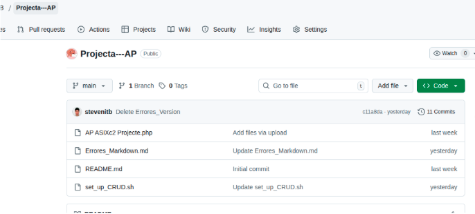
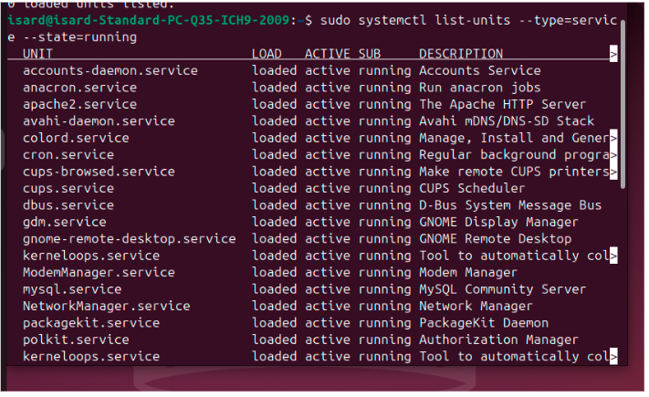
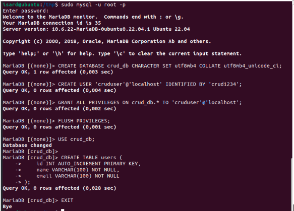
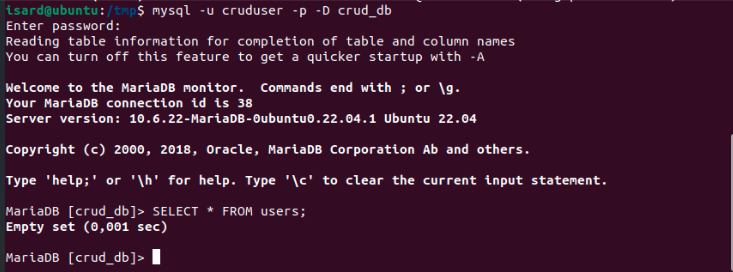
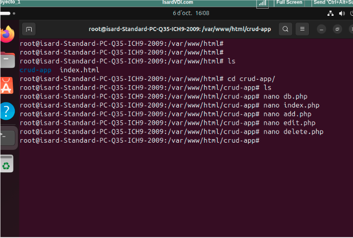
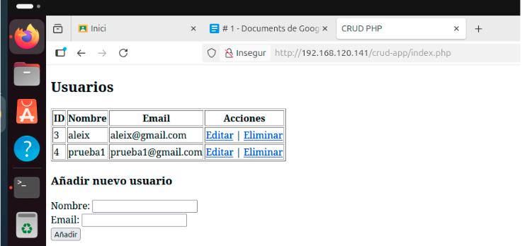
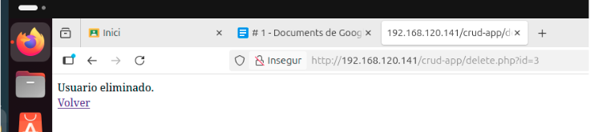
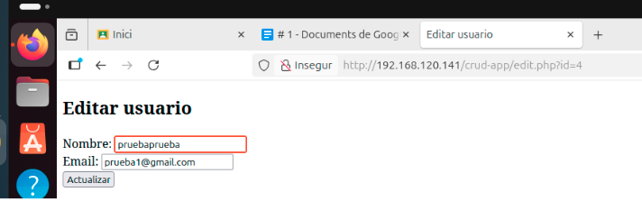
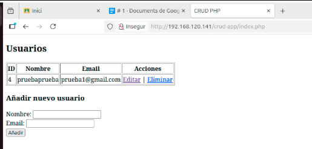
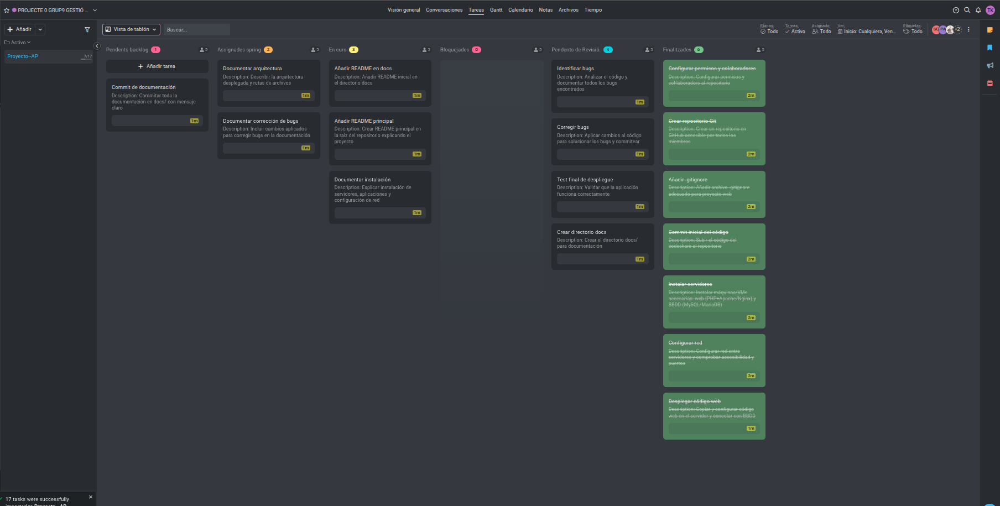

# AP - Trabajo con git y despliegue de código inicial

## INDEX
1. [Introduccion](#Introduccion)
2. [Objetivo del proyecto](objetivo-del-proyecto)
3. [Creación del Repositorio](#Creación-del-Repositorio)
4. [Errores Encontrados y Soluciones](#Errores-Encontrados-y-Soluciones)
5. [Instalacion y configuración](#instalacion-y-configuracion)
6. [Arquitectura del Proyecto](#Arquitectura-del-Proyecto)
7. [Base de Datos](#Base-de-Datos)
8. [Archivos del Proyecto Web](#Archivos-del-Proyecto-Web)
9. [Funcionamiento del Proyecto](#Funcionamiento-del-Proyecto)
10. [Conclusión](#Conclusión)

---

## Introduccion

Este proyecto se trata de la configuracion de servidore, indentificacion de bugs y correcion de estos.

## Objetivo del Proyecto

- Crear un repositorio Git compartido entre los miembros del equipo.  
- Desarrollar la aplicación web y base de datos en servidores.  
- Identificar y corregir bugs presentes en el código inicial.  
- Documentar todo el proceso en Markdown.

## 1. Creación del Repositorio

Primero de todo, hemos creado el repositorio en Git, compartiéndolo con todos los miembros del equipo y con la estructura correspondiente que se pide en la actividad.

---

## 2. Servidores de Desarrollo y Producción

Hemos desarrollado el proyecto en dos servidores diferentes:

- Servidor 1 (Pruebas): Donde desarrollamos el inicio del proyecto y realizamos las pruebas necesarias para verificar que el código funcione correctamente.
- Servidor 2 (Producción): Donde finalmente desplegamos el proyecto una vez validado en el servidor de pruebas.

En ambos servidores hemos instalado los servicios necesarios para ejecutar el código, como:
- mysql
- apache2
- y otros componentes requeridos por el proyecto.

---

## 3. Errores Encontrados y Soluciones

A continuación, se muestran los errores detectados en los archivos proporcionados y sus respectivas correcciones.

### Archivo db.php

Original:  
$servername = "locahost"; // mal escrito

Corregido:  
$servername = "localhost"; // hostname correcto

---

### Script SQL - Crear Base de Datos

Original:  
CREATE DATABASE crud_db CHARACTER SET utf8mb4 COLLATE utf8mb4_unicode_ci Where false;  

Corregido:  
CREATE DATABASE IF NOT EXISTS crud_db CHARACTER SET utf8mb4 COLLATE utf8mb4_unicode_ci;  

Explicación: WHERE false no existe en SQL; se añade IF NOT EXISTS para evitar error si la BD ya existe.

---

### Archivo add.php - INSERT

Original:  
$stmt = $conn->prepare("INSERT INTO users (name, email) VALUES (*, ?)");

Corregido:  
$stmt = $conn->prepare("INSERT INTO users (name, email) VALUES (?, ?)");

---

### Archivo index.php - Formulario

Original:  
<form action="add.php" method="posts">

Corregido:  
<form action="add.php" method="post">

---

### Archivo index.php - Tabla Duplicada

Original:  
<table>  
<table border="1">

Corregido:  
<table border="1">

---

### Archivo edit.php - UPDATE

Original:  
$stmt = $conn->prepare("UPDATE users where name=?, email=? WHERE id=?");

Corregido:  
$stmt = $conn->prepare("UPDATE users SET name = ?, email = ? WHERE id = ?");

Explicación: SET es obligatorio para indicar las columnas a actualizar.

---

### Archivo delete.php - DELETE

Original:  
$conn->query("DELETE * FROM users WHERE id=$id");

Corregido:  
$conn->query("DELETE FROM users WHERE id=$id");

---

### Escapado de Datos en PHP

Original:  
echo "<td>{$row['name']}</td>";

Corregido:  
echo "<td>" . htmlspecialchars($row['name'], ENT_QUOTES) . "</td>";

Explicación: Evita inyección de HTML/JS mostrando caracteres especiales correctamente.

---

## 4. Arquitectura del Proyecto

La arquitectura desarrollada se basa en dos servidores:

- Server 1: Servidor de pruebas donde se desarrolla el prototipo.
- Server 2: Servidor de producción donde se despliega el proyecto final una vez validado.

A continuación, se muestra el esquema general de la arquitectura:

---

## 5. Base de Datos

Hemos creado las bases de datos correspondientes, tal como se muestra en la siguiente imagen:

---

## 6. Archivos del Proyecto Web

Se han creado todos los archivos que forman la página web mediante el servicio Apache2.

En cada archivo, hemos corregido los errores del código original y aplicado las soluciones descritas anteriormente.

Ejemplo de estructura de archivos:

/var/www/html/  
│  
├── db.php  
├── index.php  
├── add.php  
├── edit.php  
├── delete.php  
└── assets/

---

## 7. Funcionamiento del Proyecto

Una vez subidos todos los archivos corregidos al servidor, accedemos a la página web donde está alojado el código y comprobamos su correcto funcionamiento.

El sistema permite:

- Añadir usuarios  
- Eliminar usuarios  
- Editar usuarios  
- Guardar todos los cambios en la base de datos MySQL

---

## Metodo de organizacion

Para poder tener un trabajo organizado y metodico hemos utilizado PROOFHUB, con el cual nos hemos podido distribuir las tareas correctamente.

## Conclusión

El proyecto ha sido implementado correctamente tanto en el entorno de desarrollo como en el entorno de producción.  
Se han solucionado todos los errores encontrados en el código original, asegurando un funcionamiento estable y seguro.